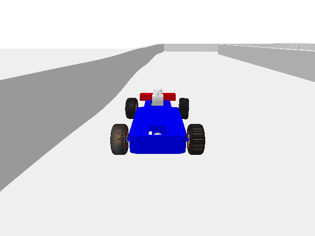

<h1>My Research Projects</h1>

My Reinforcement Learning Projects

My Robotics Projects

My Formal Methods Projects

My Machine Learning Projects

## auto-shaping (coming soon)
I am developing and maintaining [`auto-shaping`](https://github.com/luigiberducci/auto-shaping)
to facilitate research on **logic-based reward shaping** for Reinforcement Learning.

This library is compatible with the **gymnasium** API, 
it wraps the environment with the desired reward shaping method while maintaining compatibility 
with stable RL libraries (e.g., `stable-baselines3`, `omnisafe`).

[`auto-shaping`](https://github.com/luigiberducci/auto-shaping) 
currently implements several **automatic reward** shaping methods, including TLTL, BHNR, HPRS,
and provides **requirement specifications** for several control environments.

**[Want to know more?](https://github.com/luigiberducci/auto-shaping)**

## racecar-gym
I have been developing and maintaining [`racecar_gym`](https://github.com/axelbr/racecar_gym) with Axel Brunnbauer. 

This environment uses the Bullet physics engine and 
aims to facilitate experiments of **Reinforcement Learning** 
with miniature, [f1tenth](https://f1tenth.org/)-like **racecars**.

[`racecar_gym`](https://github.com/axelbr/racecar_gym) currently implements the Gym API and the PettingZoo API, and
supports **single-** and **multi-agent** racing scenarios with **several tracks** of increasing difficulty:
from simple circular tracks, to scaled F1 tracks (e.g., Spielberg) and real-world tracks built 
in our university facilities (e.g., Treitlstrasse).

**[Want to know more?](https://github.com/axelbr/racecar_gym)**

